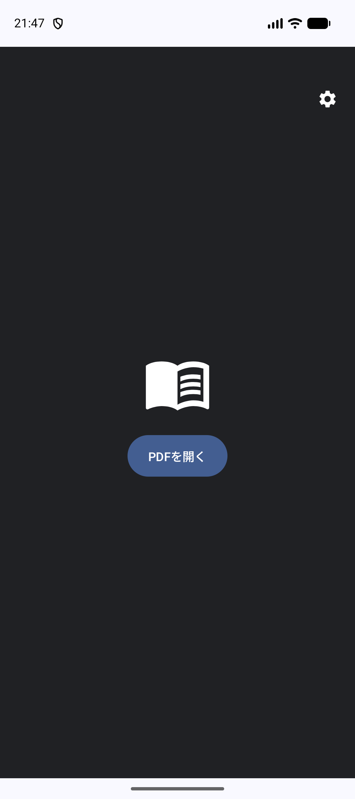
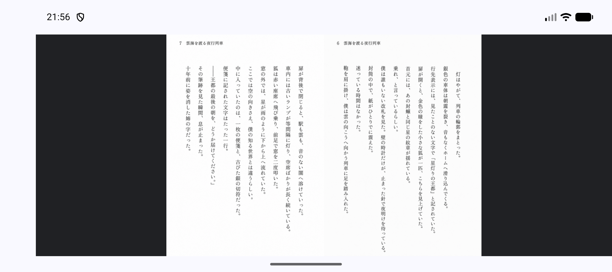
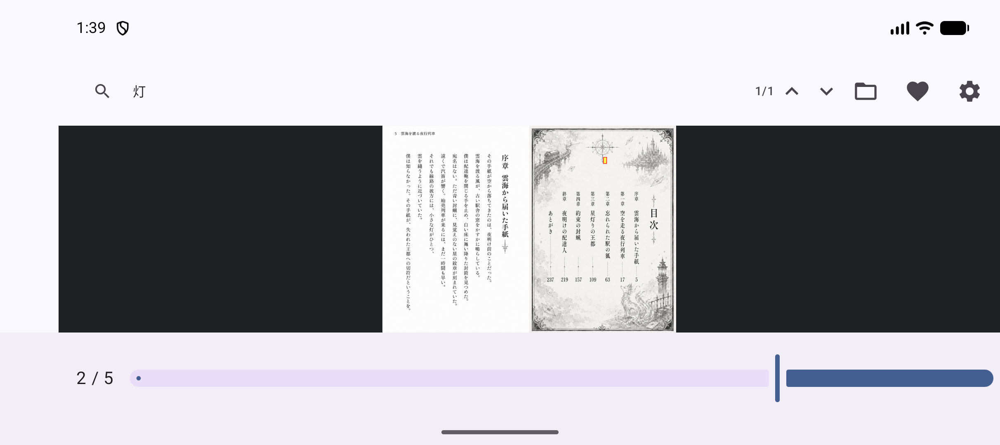
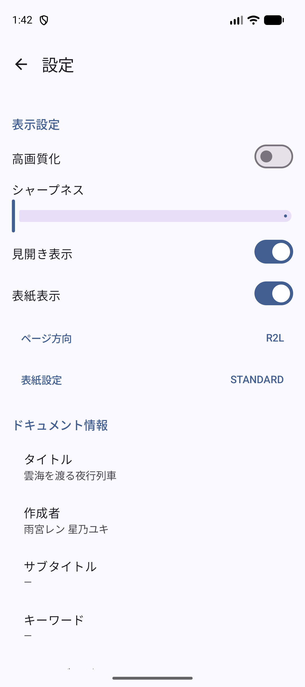

# MihirakiPDFViewer for Android

[](https://github.com/tyamada/MihirakiPDFViewer_Android/actions)
[](LICENSE)

**MihirakiPDFViewer** は、日本特有の「右綴じ」や「見開き」ドキュメント（漫画やライトノベルなど）を快適に閲覧するために設計された、プライバシー重視のモダンな Android 用ローカル PDF ビューアです。

**Kotlin**、**Jetpack Compose**、**Material 3** を使用し、**MVVM** アーキテクチャに基づいて構築されています。

## ✨ 主な機能

- 📖 **見開き表示対応**: 2つのページを横に並べてシームレスに表示します。
- 🔄 **自動構成検出**: PDF のメタデータからページレイアウト（単一/見開き）と読書方向（左綴じ/右綴じ）を自動的に検出し、最適な設定を適用します。
- 🇯🇵 **右綴じ（R2L）完全対応**: 日本の書籍特有の右から左への読書順序や、右綴じの製本レイアウトをネイティブにサポート。
- 🔍 **強力な検索機能**: 高速なテキスト検索に加え、ヒット箇所を精密にハイライト（黄色背景と赤枠）表示します。
- 🛡️ **プライバシー重視**: PDF 処理にインターネット接続は不要です。Storage Access Framework (SAF) を使用し、ユーザーが明示的に選択したファイルのみにアクセスします。
- 🚀 **高性能レンダリング**: Android 標準の `PdfRenderer` を使用し、互換性と機能向上のために `PDFBox-Android` をフォールバックとして併用します。
- 🎨 **アダプティブ UI**: スマートフォンとタブレットの両方、さらに縦向きと横向きのどちらでも快適に動作するレスポンシブデザイン。

> [!NOTE]
> **インターネット接続について**: **Google ドライブ** などのクラウドストレージ上の PDF ファイルを開く場合にのみ、インターネット接続が必要です。端末内に保存されているローカルの PDF ファイルを閲覧するだけなら、インターネット接続は一切不要です。

## 📱 スクリーンショット

| ホーム画面 | ビューア（見開き） | 検索ハイライト | 設定画面 |
| :---: | :---: | :---: | :---: |
|  |  |  |  |

## 🛠 技術スタック

- **言語**: [Kotlin](https://kotlinlang.org/)
- **UI フレームワーク**: [Jetpack Compose](https://developer.android.com/jetpack/compose)
- **デザインシステム**: [Material 3](https://m3.material.io/)
- **アーキテクチャ**: MVVM (Model-View-ViewModel)
- **PDF エンジン**: 標準 `PdfRenderer` + [PDFBox-Android](https://github.com/TomRoush/PdfBox-Android)
- **ローカルストレージ**: [Jetpack DataStore](https://developer.android.com/topic/libraries/architecture/datastore) (Preferences)
- **ナビゲーション**: [Jetpack Navigation Compose](https://developer.android.com/jetpack/compose/navigation)
- **アプリ内課金**: [Google Play Billing Library](https://developer.android.com/google/play/billing) (開発者応援チップ用)

## 🚀 はじめに

### 動作要件
- Android Studio Ladybug (またはそれ以降)
- JDK 17
- Android SDK 37

### ビルド方法
1. リポジトリをクローンします:
   ```bash
   git clone https://github.com/tyamada/MihirakiPDFViewer_Android.git
   ```
2. Android Studio でプロジェクトを開きます。
3. Gradle ファイルと同期します。
4. エミュレーターまたは実機（minSdk 26 以上）で実行します。

## 🧪 テスト
ユニットテストおよびインストルメンテーション UI テストを実行できます:
```bash
./gradlew test
./gradlew connectedAndroidTest
```

## 💖 開発者の応援
アプリを気に入っていただけた場合は、アプリ内の「応援」機能から開発を支援できます。Bronze、Silver、Gold の各チップを贈ると、設定画面に特別な記念アイコンが表示されます！

## 🤖 AI による開発
このプロジェクトは、AI アシスタントを活用して開発されています：
- **初期コード作成**: [ChatGPT](https://chat.openai.com/)
- **コードの変更・機能追加・バグ修正**: [Gemini 3.0 Flash Preview](https://deepmind.google/technologies/gemini/flash/) (Android Studio 経由)

## 📄 ライセンス
このプロジェクトは MIT License の下でライセンスされています。詳細は [LICENSE](LICENSE) ファイルを参照してください。

---
*注: このアプリはローカルファイル閲覧用に最適化されており、ドキュメントをサーバーにアップロードすることはありません。*
