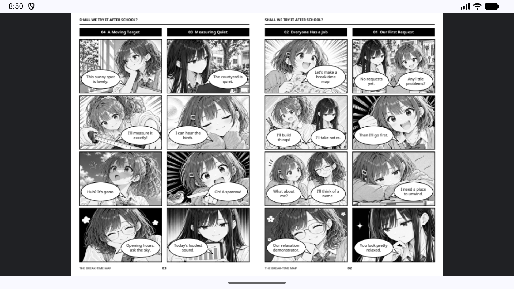
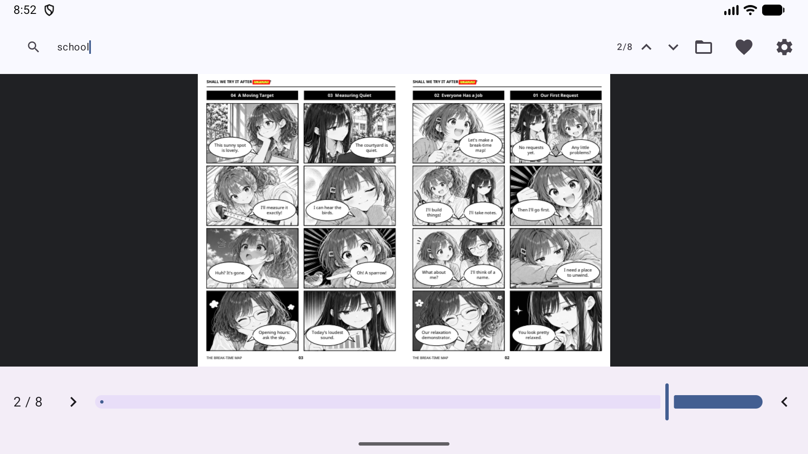
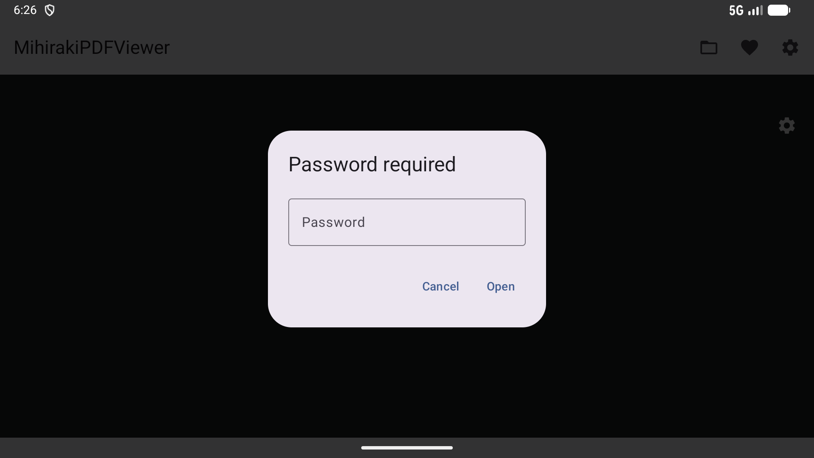
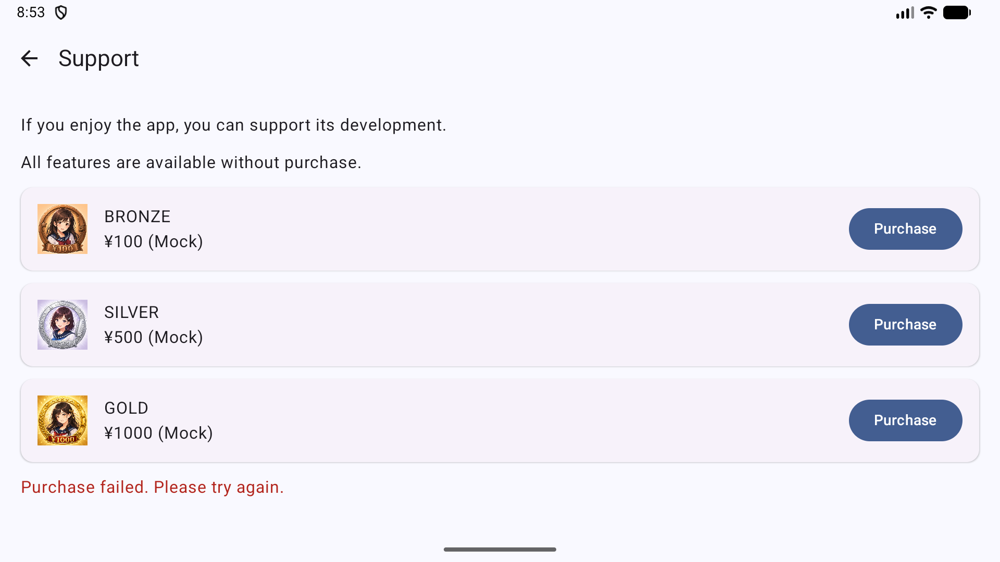
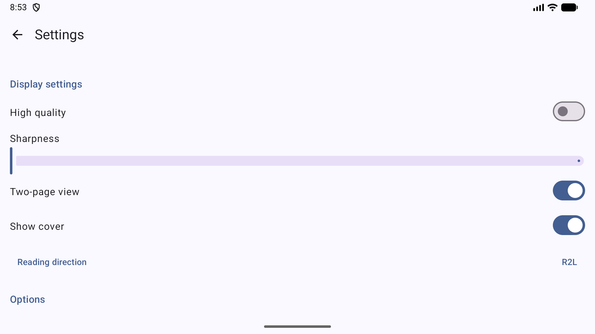

# MihirakiPDFViewer for Android

[](https://play.google.com/store/apps/details?id=com.github.tyamada.MihirakiPDFViewer_Android)
[](LICENSE)

English | [日本語](README_ja.md)

**MihirakiPDFViewer** is a modern, privacy-focused local PDF viewer for Android designed specifically for an optimal reading experience of two-page spreads and right-to-left (R2L) documents like Japanese Manga and Light Novels.

Built with **Kotlin**, **Jetpack Compose**, and **Material 3** following the **MVVM** architecture.

## ✨ Features

- 📖 **Two-Page Spread Support**: Seamlessly view two pages side-by-side.
- 🔄 **Auto-Detection**: Automatically detects page layout (Single/Spread) and reading direction (L2R/R2L) from PDF metadata.
- 🇯🇵 **R2L Support**: Native support for right-to-left reading order and right-bound book layouts.
- 🔍 **Powerful Search**: Fast text search with precise hit highlighting (yellow background and red border).
- 🛡️ **Privacy First**: No internet permissions required for PDF processing. Uses Storage Access Framework (SAF) to only access files you choose.
- 🚀 **Performant Rendering**: Uses Android's native `PdfRenderer` with a fallback to `PDFBox-Android` for maximum compatibility and features.
- 🎨 **Adaptive UI**: Responsive design that works great on both phones and tablets, in portrait and landscape.
- 🖱️ **Desktop Mouse & Edge-Click Navigation**: Intuitive page turning by clicking the left and right edges on desktop/mouse navigation mode, configurable in Settings.
- 📱 **Adaptive Portrait Display**: Automatically switches to single-page display in portrait orientation (defaulting to single-page on smartphones and spread on tablets, configurable in Settings).
- 📋 **Diagnostics & Persistent Logging**: In-app device diagnostic testing and local app log management (stored securely locally for up to 24 hours, with zero personal/file data logging and no automatic external transmission).

> [!NOTE]
> **Internet Connectivity**: An internet connection is required only when opening PDF files stored on **Google Drive** or other cloud services. For PDF files stored locally on your device, no internet connection is required.

## 📱 Screenshots

| Viewer (Spread) | Search | Password Protection | Support | Settings |
| :---: | :---: | :---: | :---: | :---: |
|  |  |  |  |  |

## 🛠 Tech Stack

- **Language**: [Kotlin](https://kotlinlang.org/)
- **UI Framework**: [Jetpack Compose](https://developer.android.com/jetpack/compose)
- **Design System**: [Material 3](https://m3.material.io/)
- **Architecture**: MVVM (Model-View-ViewModel)
- **PDF Engine**: Native `PdfRenderer` + [PDFBox-Android](https://github.com/TomRoush/PdfBox-Android)
- **Local Storage**: [Jetpack DataStore](https://developer.android.com/topic/libraries/architecture/datastore) (Preferences)
- **Navigation**: [Jetpack Navigation Compose](https://developer.android.com/jetpack/compose/navigation)
- **In-App Billing**: [Google Play Billing Library](https://developer.android.com/google/play/billing) (for developer support tips)

## 🚀 Getting Started

### Prerequisites
- Android Studio Ladybug (or newer)
- JDK 17
- Android SDK 37

### Build
1. Clone the repository:
   ```bash
   git clone https://github.com/tyamada/MihirakiPDFViewer_Android.git
   ```
2. Open the project in Android Studio.
3. Sync the project with Gradle files.
4. Run the app on an emulator or a physical device (minSdk 26).

## 📚 Sample PDFs
Try out MihirakiPDFViewer with these sample PDF files:
- [THE TRY-IT CLUB EPISODE 1 THE BREAK-TIME MAP (English)](docs/sample/tameshibu_episode1_2_en.pdf) (23MB)
- [THE TRY-IT CLUB EPISODE 2 ROOM TO GROW (English)](docs/sample/tameshibu_episode2_2_en.pdf) (24MB)
- [ためし部 第１話 ひと息マップ (Japanese)](docs/sample/tameshibu_episode1_2_ja.pdf) (23MB)
- [ためし部 第２話 机、ひろがる。 (Japanese)](docs/sample/tameshibu_episode2_2_ja.pdf) (24MB)
- [해봄부 제1화 한숨 돌림 지도 (Korean)](docs/sample/tameshibu_episode1_2_ko.pdf) (23MB)
- [해봄부제2화 책상이 넓어지다 (Korean)](docs/sample/tameshibu_episode2_2_ko.pdf) (24MB)
- [试试社 第1话 歇口气地图 (Chinese (Simplified))](docs/sample/tameshibu_episode1_2_zh_cn.pdf) (23MB)
- [试试社 第2话 桌子变大了 (Chinese (Simplified))](docs/sample/tameshibu_episode2_2_zh_cn.pdf) (24MB)
- [DER PROBIERCLUB FOLGE 1 (German)](docs/sample/tameshibu_episode1_2_de.pdf) (23MB)
- [DER PROBIERCLUB FOLGE 2 (German)](docs/sample/tameshibu_episode2_2_de.pdf) (24MB)
- [LE CLUB DES ESSAIS EPISODE 1 (French)](docs/sample/tameshibu_episode1_2_fr.pdf) (23MB)
- [LE CLUB DES ESSAIS EPISODE 2 (French)](docs/sample/tameshibu_episode2_2_fr.pdf) (24MB)
- [試試社 第1話 (Chinese (Traditional))](docs/sample/tameshibu_episode1_2_zh_tw.pdf) (23MB)
- [試試社 第2話 (Chinese (Traditional))](docs/sample/tameshibu_episode2_2_zh_tw.pdf) (24MB)

### Sample PDF License & Attribution
**"The Try-It Club" Episodes 1 & 2**
© 2026 Komairo Biyori

Parts of this work to which the publisher holds copyright and other licensable rights are provided under the Creative Commons Attribution 4.0 International (CC BY 4.0) license.
https://creativecommons.org/licenses/by/4.0/

When reusing this work, please display the title, author name "Komairo Biyori", the publisher of the original work, and a link to the license, and clearly indicate if any changes were made.

This work uses generative AI for the creation of text, images, and translation. Materials whose rights belong to third parties, such as fonts, are subject to their respective licenses. This notice does not restrict the use of parts of the work that are not protected by copyright or similar rights.

## 🧪 Testing & Diagnostics
Run unit tests and instrumented UI tests. Test PDF files are available [here](https://1drv.ms/f/c/7a27b2713c2c2c38/IgDLhBYHJMKbRrvH92OpdA6jAQ4VUZNjFrJhqSYs9W4-BTo?e=JaNqSa).
```bash
./gradlew test
./gradlew connectedAndroidTest
```
- **In-App Diagnostics**: Access "Testing & Diagnostics" in Settings to inspect real-time memory usage and rolling application logs (`AppLogger`).
- **Performance & Stress Tests**: Includes automated memory tracking, rapid page navigation stress tests, and multi-document switching stability tests.

## 📋 Verification List
Device compatibility and verification results tested by developers and users are documented in [VERIFICATION_LIST.md](VERIFICATION_LIST.md).

## 💖 Support the Developer
If you find this app useful, you can support further development via the in-app "Support" feature. We offer Bronze, Silver, and Gold tip tiers, which unlock a special commemorative icon in your settings screen!

## 🐛 Reporting Issues & Bug Reports
If you encounter any bugs, crashes, or unexpected behavior, please open an issue on [GitHub Issues](https://github.com/tyamada/MihirakiPDFViewer_Android/issues). 
When reporting an issue, please include:
1. **App Version & Build Code** (e.g., v2.0.0, Code 23)
2. **Device Model & Android Version** (e.g., Pixel 8, Android 15)
3. **Steps to Reproduce** the problem
4. **Diagnostic Logs**: Copy or share app logs from **Settings > Testing & Diagnostics** (safe: contains zero personal or document data).

## 🤖 Developed with AI
This project was developed with the assistance of AI:
- **Initial Code Generation**: [ChatGPT](https://chat.openai.com/)
- **Modifications, Feature Implementation & Bug Fixes**: [Gemini 3.0 Flash Preview](https://deepmind.google/technologies/gemini/flash/) (via Android Studio)

## 📜 Version History

- **v2.0.0** (Code 23)
  - Major version bump to v2.0.0 with comprehensive documentation updates and help screen HTML rendering enhancements.
  - Added direct "Report Issue" button to the settings screen and established GitHub Issue templates.
  - Reorganized settings options group (placing Mouse Navigation and Portrait Display switches at the top of options).
  - Improved screen rotation synchronization for adaptive portrait display.
- **v1.4.0** (Code 22)
  - Updated tip purchases from consumable to non-consumable to comply with App Store review guidelines.
  - Reorganized and updated store listing assets and sample PDFs.
- **v1.3.0** (Code 21)
  - Improved settings screen layout by relocating options group below document info.
  - Enabled advanced R8 optimizations and native debug symbols for improved performance and crash reporting.
- **v1.2.4** (Code 18)
  - Minor settings screen layout adjustments.
- **v1.2.3** (Code 17)
  - Consolidated and organized store listing materials and device screenshots.
- **v1.0.0** (Code 20)
  - Initial production release with two-page spread support, R2L reading order, smart auto-detection, precise search & highlighting, and privacy-focused local PDF processing.

## 📄 License
This project is licensed under the MIT License - see the [LICENSE](LICENSE) file for details.

---
*Note: This app is optimized for local file viewing and does not upload your documents to any server.*
