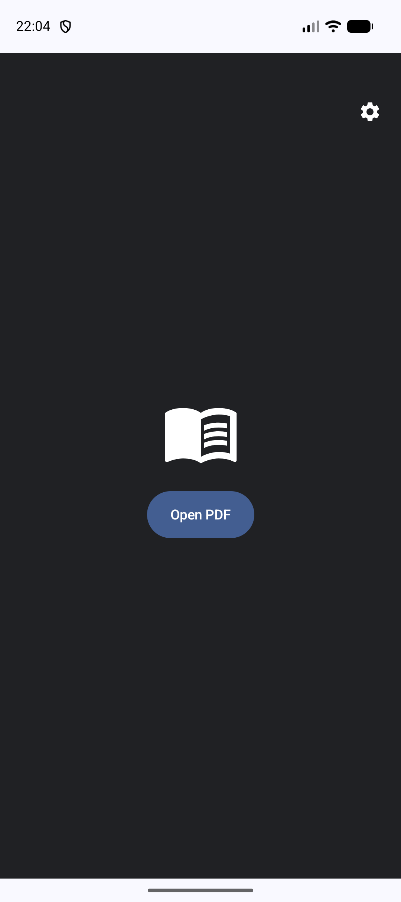
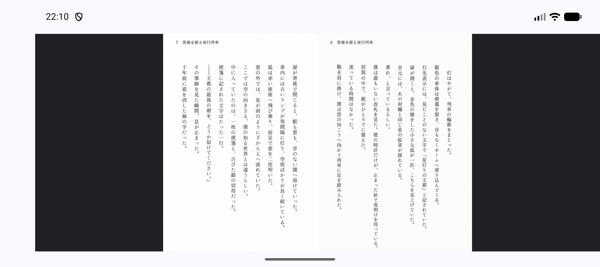
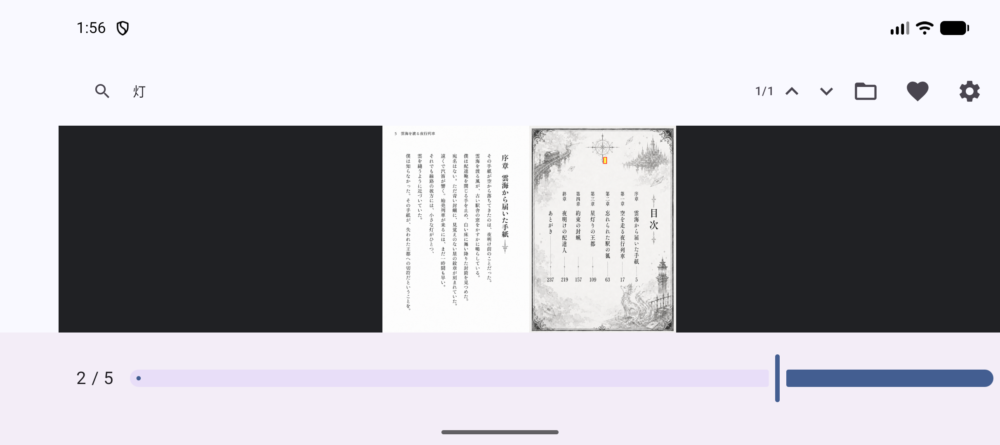
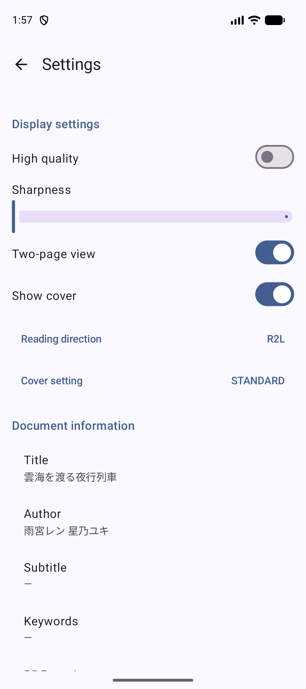

# MihirakiPDFViewer for Android

[](https://github.com/your-username/MihirakiPDFViewer_Android/actions)
[](LICENSE)

**MihirakiPDFViewer** is a modern, privacy-focused local PDF viewer for Android designed specifically for an optimal reading experience of two-page spreads and right-to-left (R2L) documents like Japanese Manga and Light Novels.

Built with **Kotlin**, **Jetpack Compose**, and **Material 3** following the **MVVM** architecture.

## ✨ Features

- 📖 **Two-Page Spread Support**: Seamlessly view two pages side-by-side.
- 🔄 **Auto-Detection**: Automatically detects page layout (Single/Spread) and reading direction (L2R/R2L) from PDF metadata.
- 🇯🇵 **R2L Support**: Native support for right-to-left reading order and right-bound book layouts.
- 🔍 **Powerful Search**: Fast text search with precise hit highlighting (yellow background and red border).
- 🛡️ **Privacy First**: No internet permissions required for PDF processing. Uses Storage Access Framework (SAF) to only access files you choose.
- 🚀 **Performant Rendering**: Uses Android's native `PdfRenderer` with a fallback to `PDFBox-Android` for maximum compatibility and features.
- 🎨 **Adaptive UI**: Responsive design that works great on both phones and tablets, in portrait and landscape.

> [!NOTE]
> **Internet Connectivity**: An internet connection is required only when opening PDF files stored on **Google Drive** or other cloud services. For PDF files stored locally on your device, no internet connection is required.

## 📱 Screenshots

| Home Screen | Viewer (Spread) | Search Highlighting | Settings |
| :---: | :---: | :---: | :---: |
|  |  |  |  |

## 🛠 Tech Stack

- **Language**: [Kotlin](https://kotlinlang.org/)
- **UI Framework**: [Jetpack Compose](https://developer.android.com/jetpack/compose)
- **Design System**: [Material 3](https://m3.material.io/)
- **Architecture**: MVVM (Model-View-ViewModel)
- **PDF Engine**: Native `PdfRenderer` + [PDFBox-Android](https://github.com/TomRoush/PdfBox-Android)
- **Local Storage**: [Jetpack DataStore](https://developer.android.com/topic/libraries/architecture/datastore) (Preferences)
- **Navigation**: [Jetpack Navigation Compose](https://developer.android.com/jetpack/compose/navigation)
- **In-App Billing**: [Google Play Billing Library](https://developer.android.com/google/play/billing) (for developer support tips)

## 🚀 Getting Started

### Prerequisites
- Android Studio Ladybug (or newer)
- JDK 17
- Android SDK 37

### Build
1. Clone the repository:
   ```bash
   git clone https://github.com/tyamada/MihirakiPDFViewer_Android.git
   ```
2. Open the project in Android Studio.
3. Sync the project with Gradle files.
4. Run the app on an emulator or a physical device (minSdk 26).

## 🧪 Testing
Run unit tests and instrumented UI tests:
```bash
./gradlew test
./gradlew connectedAndroidTest
```

## 💖 Support the Developer
If you find this app useful, you can support further development via the in-app "Support" feature. We offer Bronze, Silver, and Gold tip tiers, which unlock a special commemorative icon in your settings screen!

## 🤖 Developed with AI
This project was developed with the assistance of AI:
- **Initial Code Generation**: [ChatGPT](https://chat.openai.com/)
- **Modifications, Feature Implementation & Bug Fixes**: [Gemini 3.0 Flash Preview](https://deepmind.google/technologies/gemini/flash/) (via Android Studio)

## 📄 License
This project is licensed under the MIT License - see the [LICENSE](LICENSE) file for details.

---
*Note: This app is optimized for local file viewing and does not upload your documents to any server.*
