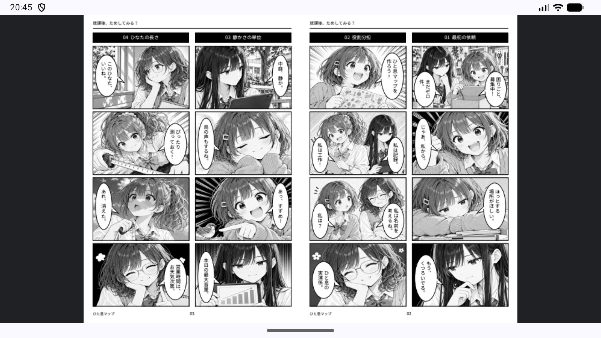
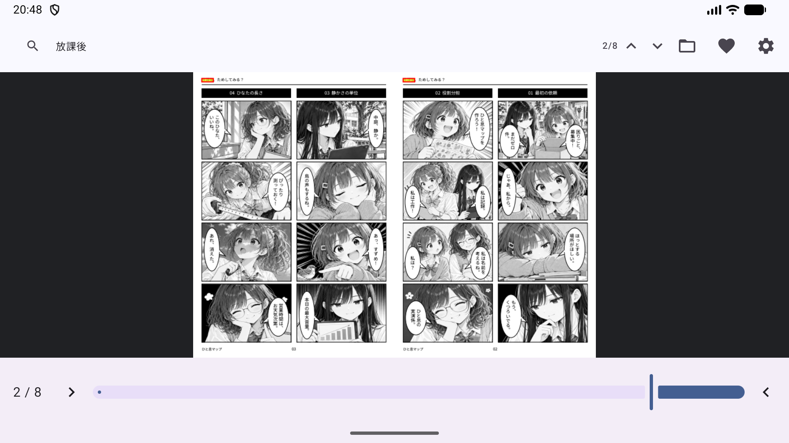
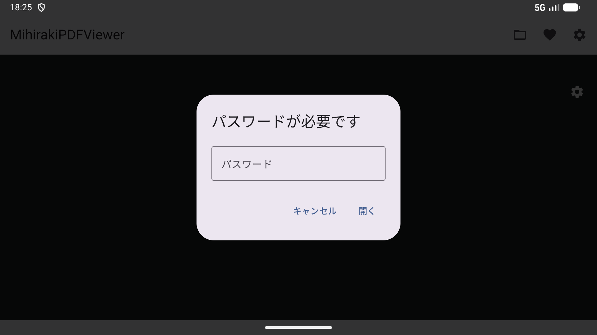
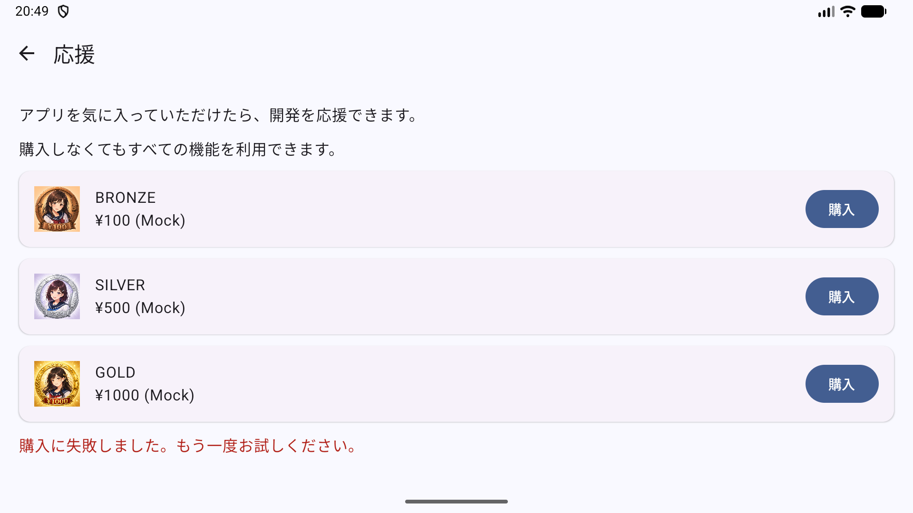
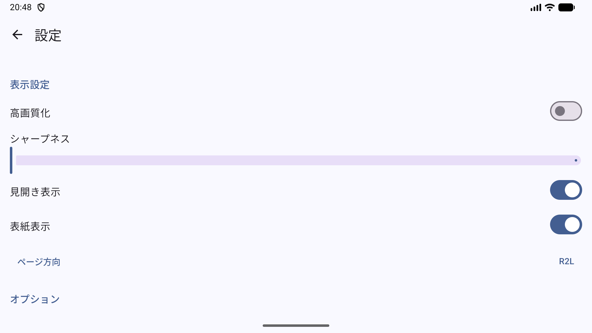

# 見開きPDFビューア (MihirakiPDFViewer) for Android

[](https://play.google.com/store/apps/details?id=com.github.tyamada.MihirakiPDFViewer_Android)
[](LICENSE)

[English](README.md) | 日本語

**見開きPDFビューア** (**MihirakiPDFViewer**) は、日本特有の「右綴じ」や「見開き」ドキュメント（漫画やライトノベルなど）を快適に閲覧するために設計された、プライバシー重視のモダンな Android 用ローカル PDF ビューアです。

**Kotlin**、**Jetpack Compose**、**Material 3** を使用し、**MVVM** アーキテクチャに基づいて構築されています。

## ✨ 主な機能

- 📖 **見開き表示対応**: 2つのページを横に並べてシームレスに表示します。
- 🔄 **自動構成検出**: PDF のメタデータからページレイアウト（単一/見開き）と読書方向（左綴じ/右綴じ）を自動的に検出し、最適な設定を適用します。
- 🇯🇵 **右綴じ（R2L）完全対応**: 日本の書籍特有の右から左への読書順序や、右綴じの製本レイアウトをネイティブにサポート。
- 🔍 **強力な検索機能**: 高速なテキスト検索に加え、ヒット箇所を精密にハイライト（黄色背景と赤枠）表示します。
- 🛡️ **プライバシー重視**: PDF 処理にインターネット接続は不要です。Storage Access Framework (SAF) を使用し、ユーザーが明示的に選択したファイルのみにアクセスします。
- 🚀 **高性能レンダリング**: Android 標準の `PdfRenderer` を使用し、互換性と機能向上のために `PDFBox-Android` をフォールバックとして併用します。
- 🎨 **アダプティブ UI**: スマートフォンとタブレットの両方、さらに縦向きと横向きのどちらでも快適に動作するレスポンシブデザイン。
- 📋 **診断・アプリログ管理**: 端末診断テストの実行や、ローカルでのアプリログ保存・共有機能を搭載。ログは端末内に最大24時間安全に保存され、個人情報やファイルの内容は一切記録されません（自動外部送信なし）。

> [!NOTE]
> **インターネット接続について**: **Google ドライブ** などのクラウドストレージ上の PDF ファイルを開く場合にのみ、インターネット接続が必要です。端末内に保存されているローカルの PDF ファイルを閲覧するだけなら、インターネット接続は一切不要です。

## 📱 スクリーンショット

| ビューア（見開き） | 検索 | パスワード保護 | 応援 | 設定 |
| :---: | :---: | :---: | :---: | :---: |
|  |  |  |  |  |

## 🛠 技術スタック

- **言語**: [Kotlin](https://kotlinlang.org/)
- **UI フレームワーク**: [Jetpack Compose](https://developer.android.com/jetpack/compose)
- **デザインシステム**: [Material 3](https://m3.material.io/)
- **アーキテクチャ**: MVVM (Model-View-ViewModel)
- **PDF エンジン**: 標準 `PdfRenderer` + [PDFBox-Android](https://github.com/TomRoush/PdfBox-Android)
- **ローカルストレージ**: [Jetpack DataStore](https://developer.android.com/topic/libraries/architecture/datastore) (Preferences)
- **ナビゲーション**: [Jetpack Navigation Compose](https://developer.android.com/jetpack/compose/navigation)
- **アプリ内課金**: [Google Play Billing Library](https://developer.android.com/google/play/billing) (開発者応援チップ用)

## 🚀 はじめに

### 動作要件
- Android Studio Ladybug (またはそれ以降)
- JDK 17
- Android SDK 37

### ビルド方法
1. リポジトリをクローンします:
   ```bash
   git clone https://github.com/tyamada/MihirakiPDFViewer_Android.git
   ```
2. Android Studio でプロジェクトを開きます。
3. Gradle ファイルと同期します。
4. エミュレーターまたは実機（minSdk 26 以上）で実行します。

## 📚 サンプルPDF
以下のサンプルPDFファイルで MihirakiPDFViewer をお試しください：
- [ためし部 第１話 ひと息マップ (Japanese)](docs/sample/tameshibu_episode1_2_ja.pdf) (23MB)
- [ためし部 第２話 机、ひろがる。 (Japanese)](docs/sample/tameshibu_episode2_2_ja.pdf) (24MB)
- [THE TRY-IT CLUB EPISODE 1 THE BREAK-TIME MAP (English)](docs/sample/tameshibu_episode1_2_en.pdf) (23MB)
- [THE TRY-IT CLUB EPISODE 2 ROOM TO GROW (English)](docs/sample/tameshibu_episode2_2_en.pdf) (24MB)
- [해봄부 제1화 한숨 돌림 지도 (Korean)](docs/sample/tameshibu_episode1_2_ko.pdf) (23MB)
- [해봄부제2화 책상이 넓어지다 (Korean)](docs/sample/tameshibu_episode2_2_ko.pdf) (24MB)
- [试试社 第1话 歇口气地图 (Chinese (Simplified))](docs/sample/tameshibu_episode1_2_zh_cn.pdf) (23MB)
- [试试社 第2话 桌子变大了 (Chinese (Simplified))](docs/sample/tameshibu_episode2_2_zh_cn.pdf) (24MB)
- [DER PROBIERCLUB FOLGE 1 (German)](docs/sample/tameshibu_episode1_2_de.pdf) (23MB)
- [DER PROBIERCLUB FOLGE 2 (German)](docs/sample/tameshibu_episode2_2_de.pdf) (24MB)
- [LE CLUB DES ESSAIS EPISODE 1 (French)](docs/sample/tameshibu_episode1_2_fr.pdf) (23MB)
- [LE CLUB DES ESSAIS EPISODE 2 (French)](docs/sample/tameshibu_episode2_2_fr.pdf) (24MB)
- [試試社 第1話 (Chinese (Traditional))](docs/sample/tameshibu_episode1_2_zh_tw.pdf) (23MB)
- [試試社 第2話 (Chinese (Traditional))](docs/sample/tameshibu_episode2_2_zh_tw.pdf) (24MB)

### サンプルPDFのライセンスと表示
**『ためし部』第1話・第2話**
© 2026 こまいろ日和

本作品のうち、公開者が著作権その他の許諾対象となる権利を有する部分を、Creative Commons 表示 4.0 国際（CC BY 4.0）で提供します。
https://creativecommons.org/licenses/by/4.0/

再利用時は、作品名、作者名「こまいろ日和」、原作品の公開元、ライセンスへのリンクを表示し、変更した場合はその旨を明示してください。

本作品は、文章・画像の制作および翻訳に生成AIを使用しています。フォントなど第三者に権利がある素材には、それぞれのライセンスが適用されます。著作権等による保護を受けない部分の利用を、この表示によって制限するものではありません。

## 🧪 テストと診断機能
ユニットテストおよびインストルメンテーション UI テストを実行できます。テスト用の PDF ファイルは [こちら](https://1drv.ms/f/c/7a27b2713c2c2c38/IgDLhBYHJMKbRrvH92OpdA6jAQ4VUZNjFrJhqSYs9W4-BTo?e=JaNqSa) から入手可能です。
```bash
./gradlew test
./gradlew connectedAndroidTest
```
- **アプリ内診断ログ**: 設定画面の「Testing & Diagnostics」から、リアルタイムのメモリ使用量や、インメモリバッファに記録されたアプリケーションログ (`AppLogger`) を確認できます。
- **パフォーマンス・ストレステスト**: 大容量PDFのメモリトラッキングテスト、高速ページめくりストレステスト、連続ドキュメント切り替え安定性テストが含まれています。

## 📋 動作確認リスト
開発者およびユーザーによって検証されたデバイス互換性や動作確認の結果は、[VERIFICATION_LIST.md](VERIFICATION_LIST.md) に記載されています。

## 💖 開発者の応援
アプリを気に入っていただけた場合は、アプリ内の「応援」機能から開発を支援できます。Bronze、Silver、Gold の各チップを贈ると、設定画面に特別な記念アイコンが表示されます！

## 🤖 AI による開発
このプロジェクトは、AI アシスタントを活用して開発されています：
- **初期コード作成**: [ChatGPT](https://chat.openai.com/)
- **コードの変更・機能追加・バグ修正**: [Gemini 3.0 Flash Preview](https://deepmind.google/technologies/gemini/flash/) (Android Studio 経由)

## 📜 バージョン履歴

- **v1.4.0** (コード 22)
  - アプリストアの審査ガイドラインに準拠するため、サポーター応援チップの購入処理を非消耗型（Non-consumable）に変更。
  - ストア掲載用のアセットやサンプルPDFを最新の状態に整理・更新。
- **v1.3.0** (コード 21)
  - 設定画面のレイアウトを改善（オプション項目をドキュメント情報の下へ移動）。
  - R8の最適化およびネイティブシンボルの組み込みによるパフォーマンス・安定性の向上。
- **v1.2.4** (コード 18)
  - 設定画面のレイアウト微調整。
- **v1.2.3** (コード 17)
  - ストア掲載素材やスクリーンショットの整理・統合。
- **v1.0.0** (コード 20)
  - 初回製品版リリース。見開き表示、右綴じ（R2L）完全対応、メタデータ自動検出、強力な検索・ハイライト、プライバシー重視のローカルPDF処理を実装。

## 📄 ライセンス
このプロジェクトは MIT License の下でライセンスされています。詳細は [LICENSE](LICENSE) ファイルを参照してください。

---
*注: このアプリはローカルファイル閲覧用に最適化されており、ドキュメントをサーバーにアップロードすることはありません。*
